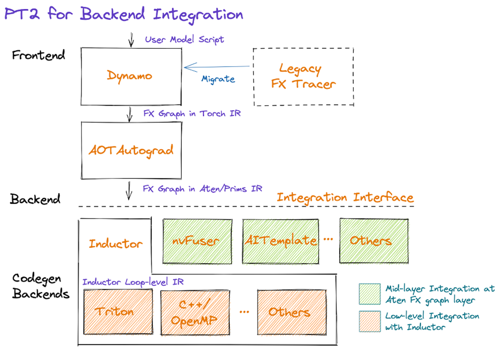

# 探索深度学习框架 PyTorch 2.0 的编译过程及多级中间表示

## 一、 实验背景与目标

PyTorch 2.0 的核心特性 `torch.compile` 引入了强大的编译器技术，旨在通过将动态的 Python 模型代码转换为静态优化的计算图，从而显著提升模型的训练和推理性能。这个过程涉及多个复杂的阶段和多种中间表示（Intermediate Representation, IR）。

本实验旨在通过插桩 (instrumentation) 的方式，深入 `torch.compile` 的内部执行流程，捕获并观察一个简单的 PyTorch 模型在编译链路中经历的各个阶段的 IR。

**实验目标：**

1.  理解 PyTorch 2.0 的编译流程，包括前端的图捕获和后端的代码生成。
2.  认识在编译过程中扮演关键角色的几种 IR，包括 Python 字节码、`FX Graph` (Torch IR)、ATen/Prims IR 和 `Inductor` IR。
3.  通过观察各级 IR 的具体形式，理解模型是如何从高级 Python API 逐步降低（Lowering）到可执行的底层代码的。
4.  加深对编译器技术在人工智能领域应用的认识。

## 二、环境配置
### 软硬件要求
+ 软件配置：
    + OS: Ubuntu 24.04
    + python: 3.12
    + pytorch: 2.7, triton: 3.3, dowhen，numpy
+ 硬件配置：
    + Nvidia GPU 服务器

### 安装说明 (基于python)
```bash
# 建议在虚拟环境比如 conda 环境内部安装 python 包
# 安装 conda 的方式参考官网上的安装方法 https://www.anaconda.com/docs/getting-started/anaconda/install#macos-linux-installation
conda create -n torch python=3.12
conda activate torch
pip install -r requirements.txt
``` 

为了打印完整的编译过程，在第二次运行 example 时，需要先删掉上一次编译结果的缓存（默认路径 `/tmp/torchinductor_root`，在 example 中通过环境变量设置了缓存路径为 example 所在目录）。

### 安装说明 (基于 jupyter)
`example.ipynb` 的内容等于 `example_1.py` 和 `example_2.py` 加上一些注释，为了便于展示运行结果，所以有 `example.ipynb` 。
```bash
# 安装
conda create -n torch python=3.12
conda activate torch
pip install -r requirements.txt
pip install notebook
# 运行
# 如果使用 vscode，打开 example.ipynb 点击右上角的 select kernel，选择 Python Environments，选择 torch 。然后点击上方偏左的 Run All 运行
```

## 三、 PyTorch 2.0 编译流程概览

`torch.compile` 的核心思想是将 Python 代码先转换为计算图，再对图进行优化和代码生成。整个流程（如下图所示）分为**前端 (Frontend)** 和 **后端 (Backend)** 两个主要部分。



### 2.1 前端 (Frontend)

前端的主要任务是 **图捕获 (Graph Capture)**，即将用户编写的动态、灵活的 Python 模型代码，准确无误地转换成静态的、可供编译器分析的图结构。

1.  **Dynamo (TorchDynamo):** 这是 PyTorch 2.0 的图捕获引擎。它并不像传统的追踪方法（如 `torch.jit.trace`）那样只记录张量操作，而是通过分析 Python **字节码 (Bytecode)** 并进行**符号执行 (Symbolic Execution)**，来捕获程序中更广泛的 Python 结构（包括控制流）。当遇到不支持的操作（所谓的 "graph break"）时，它会回退到 Python 解释器执行，从而在保证性能的同时，极大地提高了兼容性。Dynamo 的输出是一个 **FX Graph**，这是一种用 Python 代码本身来表示计算图的 IR，我们称之为 **Torch IR**。

2.  **AOTAutograd:** 该组件接收 Dynamo 捕获的 `FX Graph`。它的核心职责有两个：
    * **处理自动微分：** 它会追踪并生成反向传播图，为模型的训练过程做好准备。
    * **算子分解:** 将 `FX Graph` 中高级的、复合的 PyTorch 算子（例如 `nn.Linear`）分解为更基础、更原子的算子集合。这个标准的算子集被称为 **ATen/Prims IR**。`ATen` 是 PyTorch 底层的 C++ 算子库，`Prims` 则是一组更基础的、保证后端可实现的原子操作。这一步为不同的后端硬件和编译器提供了一个统一、规范的入口。

### 2.2 后端 (Backend)

后端接收前端处理好的 ATen/Prims IR，并负责**优化 (Optimization)** 和 **代码生成 (Code Generation)**。

1.  **Integration Interface:** 这是前后端之间的分界线，确保了前端的图捕获逻辑可以与多种不同的后端编译器无缝对接。

2.  **Inductor (TorchInductor):** 这是 PyTorch 2.0 默认的、性能最强大的编译后端。它接收 ATen-level 的 `FX Graph`，并执行以下操作：
    * **Lowering to Inductor IR:** `Inductor` 会将 `FX Graph` 进一步降低到其自身的 IR，这种 IR 由**调度节点 (Scheduler Nodes)** 构成。这个层级的 IR 是进行高性能优化的关键，例如**算子融合 (Operator Fusion)**，即将多个点操作（element-wise operations）融合成一个计算核心（Kernel），从而减少内存读写开销和 Kernel 启动开销。
    * **代码生成 (Codegen):** 在 `Inductor` IR 上完成优化后，Inductor 会调用底层的代码生成后端，将优化后的计算图编译成真正可执行的代码。默认情况下：
        * 对于 NVIDIA GPU，它会调用 **Triton** 编译器，生成高效的 Triton Kernel 代码。
        * 对于 CPU，它会生成 **C++/OpenMP** 代码，利用 SIMD 等技术进行加速。

## 四、 实验插桩代码与编译流程详解

本实验的核心是通过一个名为 `do_instrument` 的函数，利用 `dowhen` 工具库在 PyTorch 编译源码的关键位置设置插桩，从而捕获和打印各阶段的 IR。
我们将逐一解析该函数中的每一段插桩代码，并将其与 PyTorch 的编译流程对应起来。

### 第一阶段: Python 字节码的捕获与转换
- 插桩函数: `_compile`
- 源文件: `torch/_dynamo/convert_frame.py` (函数定义在第 650 行)
- 插桩点:
    - "ORIGINAL BYTECODE" (在第 786 行)
    - "MODIFIED BYTECODE" (在第 840 行)
- 功能说明: 此插桩点位于 `Dynamo` 的核心函数 `_compile` 中，用于展示对 Python 字节码的捕获和转换过程。  
    - "ORIGINAL BYTECODE"：打印被 `torch.compile` 装饰的函数的原始 Python 字节码。这是 `Dynamo` 进行分析的最初输入。
    - "MODIFIED BYTECODE"：打印经过 `Dynamo` 修改后的字节码。`Dynamo` 会重写字节码，注入钩子（hooks）和回调，以便在符号执行期间能够捕获每一条指令的操作，从而将执行逻辑转换为计算图。
- 对应插桩代码:
```Python# 捕获原始字节码
do(";".join([
    "print('='*50)",
    "print('编译的输入字节码')",
    "import dis",
    "print(dis.dis(code))",
    "print()",
])).when(_compile, ("\"ORIGINAL BYTECODE\""))

# 捕获修改后的字节码
do(";".join([
    "print('='*50)",
    "print('经过一次编译后的字节码')",
    "import dis",
    "print(dis.dis(out_code))",
    "print()",
])).when(_compile, ("\"MODIFIED BYTECODE\""))
```

### 第二阶段: 生成 Torch IR (`FX Graph`)
- 插桩方法: `_TorchCompileInductorWrapper.__call__`
- 源文件: `torch/_inductor/__init__.py` (函数定义在第 2344 行)
- 插桩点: "\<start\>" (方法入口处，在第 2344 行)
- 功能说明: 此插桩点位于 `Inductor` 后端的入口包装器中。当 `Dynamo` 完成字节码的符号执行后，会生成一个 `FX Graph`（类的定义在 `torch/_inductor/graph.py`的第 912 行） 并传递给后端。在这里，我们打印这个刚刚由 `Dynamo` 生成、尚未经过后端处理的 `FX Graph`。这个图忠实地反映了原始 Python 代码的计算流程，包含了较高层次的 Torch 算子，对应架构图中的 "`FX Graph` in Torch IR"。
- 对应插桩代码:
```Python
do(";".join([
    "print('='*50)",
    "print('由字节码符号执行得到的 Fx Graph')",
    "model_.print_readable(colored=True)", # model_ 是捕获到的 FX Graph
    "print()",
])).when(_TorchCompileInductorWrapper.__call__, ("<start>"))
```

### 第三阶段: Lowering 到 ATen/Prims IR
- 插桩方法: `GraphLowering.__init__`
- 源文件: `torch/_inductor/graph.py` (函数定义在第 269 行)
- 插桩点: "\<start\>" (方法入口处，在第 269 行)
- 功能说明: 此插桩点位于 `Inductor` 的核心类 GraphLowering 的构造函数中。它标志着后端编译的正式开始。此时输入的 `FX Graph` 已经过 AOTAutograd 的处理，图中的算子被分解（decomposed）成了更底层的 ATen/Prims IR。我们在这里打印这个 ATen-level 的 `FX Graph`，它为后续的优化和代码生成提供了一个标准的、统一的表示，对应架构图中的 "`FX Graph` in Aten/Prims IR"。
- 对应插桩代码:
```Python
do(";".join([
    "print('='*50)",
    "print('将 python api 分解为 ATen 级算子后的 Fx Graph')",
    "gm.print_readable(colored=True)", # gm 是传入的 ATen-level FX Graph
    "print()",
])).when(GraphLowering.__init__, "<start>")
```

### 第四阶段: Lowering 到 Inductor IR (调度图)
- 插桩方法: `Scheduler._codegen`
- 源文件: `torch/_inductor/scheduler.py` (函数定义在第 4185 行)
- 插桩点: "\<start\>" (方法入口处，在第 4185 行)
- 功能说明: 此插桩点位于 `Inductor` 的调度器 Scheduler 中，负责将 ATen-level 的 `FX Graph` 进一步降低（Lowering）为 `Inductor` IR。Inductor IR 由一系列调度节点（SchedulerNode）组成，这些节点是进行图优化（如算子融合）和安排代码生成顺序的基本单元。在这里，我们将打印出生成的调度节点列表，并可以观察到哪些算子被放入了融合节点（FusedSchedulerNode）中，直观地理解算子融合的过程。
- 对应插桩代码:
```Python
print_scheduler_node = ";".join([
    "print('='*50)",
    "print('将 Fx Graph lowering 为调度结点(Inductor IR):')",
    "print(nodes)", # nodes 是调度节点列表
    "print('前两个调度结点的内容为:')\n" +
    "for idx, node in enumerate(nodes[:2]):\n" + 
    # ... 打印节点的详细信息 ...
])
do(print_scheduler_node).when(Scheduler._codegen, "<start>")
```

### 第五阶段: 代码生成 (Triton / C++)
- 插桩方法: `GraphLowering._compile_to_module`
- 源文件: `torch/_inductor/graph.py` (函数定义在第 2085 行)
- 插桩点: `output_code_log.debug(\"Output code written to: %s\", path)` (在第 2115 行)
- 功能说明: 这是 `Inductor` 后端编译的最后一步。`_compile_to_module` 方法根据上一步生成的调度图（`Inductor` IR），调用最终的代码生成器（如 Triton）。在这里，我们捕获生成的代码最终被写入的文件路径。该路径指向一个临时的 `.py` 文件，其中包含了为 GPU 生成的 Triton Kernel 或为 CPU 生成的 C++/SIMD 内核函数，是 torch.compile 实现性能加速的最终产物。
- 对应插桩代码:

```Python
do(";".join([
    "print('='*50)",
    "print('从 Inductor IR 编译生成了一份 Python 代码...')",
    "print(f'路径为： {path}')", # path 是包含最终生成代码的文件路径
    "print()",
])).when(GraphLowering._compile_to_module, "output_code_log.debug(\"Output code written to: %s\", path)")
```

## 五、案例分析

本小节以`example_1.py` 给出的 `toy_example` 函数为例，讲解 PyTorch 是如何编译该函数的。注意该函数的计算是在 CPU 上执行的，Inductor 编译生成的也是 CPU 代码。对 GPU 代码生成感兴趣的同学可以执行 `example_2.py`，分析 PyTorch 对这个例子中的多层感知机网络的编译过程。

本小节将分析终端输出，深入探讨 PyTorch 编译过程中从 Python 源代码到多层级 IR 的转换，并重点解释 `Graph Break` 现象如何将一个函数拆分为多个编译单元。

### **5.1 Python 源代码及核心问题：Graph Break**

我们分析的 Python 函数如下：

```Python
def toy_example(a = torch.randn(10), b = torch.ones(10)):
    x = a / (torch.abs(a) + 1)
    if b.sum() < 0:      # <-- Graph Break 发生点
        b = b * -1
        if a.sum() < 1:
            a = a * -2
    return x * b
```

`torch.compile` 的前端 TorchDynamo 通过**符号执行** Python 字节码来捕获计算图。然而，当遇到无法在编译期静态确定的逻辑时，例如依赖于运行时数据的条件分支，就会发生 **Graph Break**。

在本例中，`if b.sum() < 0:` 这一行就是 Graph Break 的触发点。因为 `b.sum()` 的结果依赖于输入张量 `b` 的实际值，编译器无法预知 `if` 条件的真假。因此，Dynamo 必须在此处中断图的捕获，将代码的执行分为多个阶段：

1.  将 `if` 条件判断之前的所有计算（包括条件值的计算本身）捕获为**第一个子图**。
2.  返回到 Python 解释器，利用第一个子图的计算结果执行 `if` 判断。
3.  Dynamo 再次介入，捕获 `if` 语句之后或分支内的代码，形成**后续的子图**。

### **5.2 第一次 IR 转换：编译第一个子图 (Graph Before Break)**

这个子图的目标是完成 `x` 的计算，并计算出 `if` 条件 `b.sum() < 0` 所需的布尔值。

#### **5.2.1 Python 字节码输入**

Dynamo 从原始函数的字节码开始执行，捕获到条件跳转指令 `POP_JUMP_IF_FALSE` 时停止。

```Python
  4           0 RESUME                   0

  5           2 LOAD_FAST                0 (a)
              4 LOAD_GLOBAL              1 (NULL + torch)
             14 LOAD_ATTR                2 (abs)
             34 LOAD_FAST                0 (a)
             36 CALL                     1
             44 LOAD_CONST               1 (1)
             46 BINARY_OP                0 (+)
             50 BINARY_OP               11 (/)
             54 STORE_FAST               2 (x)

  6          56 LOAD_FAST                1 (b)
             58 LOAD_ATTR                5 (NULL|self + sum)
             78 CALL                     0
             86 LOAD_CONST               2 (0)
             88 COMPARE_OP               2 (<)
             92 POP_JUMP_IF_FALSE       29 (to 152)
```

#### **5.2.2 FX Graph 生成**

符号执行上述字节码后，生成了高层级的 FX Graph。

```Python
class GraphModule(torch.nn.Module):
    def forward(self, L_a_: "f32[10]", L_b_: "f32[10]"):
        l_a_ = L_a_
        l_b_ = L_b_
        
         # File: example_1.py:5 in toy_example, code: x = a / (torch.abs(a) + 1)
        abs_1: "f32[10]" = torch.abs(l_a_)
        add: "f32[10]" = abs_1 + 1;  abs_1 = None
        x: "f32[10]" = l_a_ / add;  l_a_ = add = None
        
         # File: example_1.py:6 in toy_example, code: if b.sum() < 0:
        sum_1: "f32[]" = l_b_.sum();  l_b_ = None
        lt: "b8[]" = sum_1 < 0;  sum_1 = None
        return (x, lt)
```

**关键变化分析**：

*   **结构转换**：基于堆栈操作的线性字节码指令流，被转换为表达数据依赖关系的有向无环图 (DAG)。
*   **控制流 -\> 数据流**：`if` 控制流被转化为一个数据流计算。图本身不包含 `if` 分支，而是计算出一个布尔张量 `lt` (less than)，并将其作为图的输出之一。
*   **明确的接口**：`forward` 函数的签名定义了图的输入 (`L_a_`, `L_b_`)，`return` 语句定义了图的输出：中间计算结果 `x` 和用于外部控制流的布尔值 `lt`。

#### **5.2.3 ATen 算子层级转换**

FX Graph 中的高层 API 被降级为 PyTorch 的核心算子库 ATen 中的算子。

```Python
class <lambda>(torch.nn.Module):
    def forward(self, arg0_1: "f32[10]", arg1_1: "f32[10]"):
         # File: example_1.py:5 in toy_example, code: x = a / (torch.abs(a) + 1)
        abs_1: "f32[10]" = torch.ops.aten.abs.default(arg0_1)
        add: "f32[10]" = torch.ops.aten.add.Tensor(abs_1, 1);  abs_1 = None
        div: "f32[10]" = torch.ops.aten.div.Tensor(arg0_1, add);  arg0_1 = add = None
        
         # File: example_1.py:6 in toy_example, code: if b.sum() < 0:
        sum_1: "f32[]" = torch.ops.aten.sum.default(arg1_1);  arg1_1 = None
        lt: "b8[]" = torch.ops.aten.lt.Scalar(sum_1, 0);  sum_1 = None
        return (div, lt)
```

**关键变化分析**：

*   **API 标准化**：所有操作都被映射到唯一的 `torch.ops.aten.*` 算子。例如，`torch.abs` 变为 `torch.ops.aten.abs.default`，`+` 运算符变为 `torch.ops.aten.add.Tensor`。这为后端提供了一个统一、规范的算子集。
*   **后端无关性**：ATen 层是连接前端 Python API 和后端编译器的核心桥梁，它屏蔽了前端 API 的多样性。

#### **5.2.4 Inductor IR 生成**

ATen 算子图被进一步降级为更接近硬件的 Inductor IR，它以调度节点 (SchedulerNode) 的形式描述了计算的循环和内存访问模式。

```Python
// 第一个调度节点 (计算 b.sum())
调度结点的内容:
var_ranges = {p0: 10}
index0 = p0
index1 = 0
def body(self, ops):
    get_index = self.get_index('index0')
    load = ops.load('arg1_1', get_index)
    reduction = ops.reduction(torch.float32, torch.float32, 'sum', load)
    get_index_1 = self.get_index('index1')
    store_reduction = ops.store_reduction('buf1', get_index_1, reduction)
    return store_reduction

// 第二个调度节点 (计算 sum < 0)
调度结点的内容:
var_ranges = {}
index0 = 0
def body(self, ops):
    get_index = self.get_index('index0')
    load = ops.load('buf1', get_index)
    constant = ops.constant(0.0, torch.float32)
    lt = ops.lt(load, constant)
    get_index_1 = self.get_index('index0')
    store = ops.store('buf2', get_index_1, lt, None)
    return store
```

**关键变化分析**：

*   **计算具体化**：抽象的 ATen 算子被转换为具体的循环体 (`body`)。`var_ranges = {p0: 10}` 定义了一个从 0 到 9 的循环。`reduction` 操作明确地表示了求和过程。
*   **内存操作显式化**：IR 明确地使用 `ops.load` 和 `ops.store_reduction`/`ops.store` 来描述数据的读写，`buf1` 和 `buf2` 是 Inductor 管理的中间内存缓冲区。
*   **为代码生成准备**：这个层级的 IR 非常接近最终要生成的 C++ 或 Triton 代码的结构，是进行算子融合、内存规划等底层优化的关键阶段。

#### **5.2.5 CPU kernel 生成**

```
从 Inductor IR 编译生成了一份 Python 代码，其中包含生成的 Triton kernel（用于 GPU）或 Torch 内部 SIMD 算子实现的 kernel（用于 CPU），以及输入输出逻辑。在 Inductor 内部，这份代码会被自动执行，从而生成编译后的二进制库。
路径为： compile_cache/utils/k3/ck3w7strkile63asgorr5jlssobkrzu7j4e52didzucduw6d7doo.py
```

该Python 程序代码如下：
```Python
# AOT ID: ['0_inference']
from ctypes import c_void_p, c_long, c_int
import torch
import math
import random
import os
import tempfile
from math import inf, nan
from cmath import nanj
from torch._inductor.hooks import run_intermediate_hooks
from torch._inductor.utils import maybe_profile
from torch._inductor.codegen.memory_planning import _align as align
from torch import device, empty_strided
from torch._inductor.async_compile import AsyncCompile
from torch._inductor.select_algorithm import extern_kernels
from torch._inductor.codegen.multi_kernel import MultiKernelCall

aten = torch.ops.aten
inductor_ops = torch.ops.inductor
_quantized = torch.ops._quantized
assert_size_stride = torch._C._dynamo.guards.assert_size_stride
empty_strided_cpu = torch._C._dynamo.guards._empty_strided_cpu
empty_strided_cuda = torch._C._dynamo.guards._empty_strided_cuda
empty_strided_xpu = torch._C._dynamo.guards._empty_strided_xpu
reinterpret_tensor = torch._C._dynamo.guards._reinterpret_tensor
alloc_from_pool = torch.ops.inductor._alloc_from_pool
async_compile = AsyncCompile()
empty_strided_p2p = torch._C._distributed_c10d._SymmetricMemory.empty_strided_p2p


cpp_fused_abs_add_div_lt_sum_0 = async_compile.cpp_pybinding(['const float*', 'const float*', 'float*', 'bool*', 'float*'], '''
#include "/mnt/d4/ls/workspace/torchcompile-demo/compile_cache/utils/pi/cpicxudqmdsjh5cm4klbtbrvy2cxwr7whxl3md2zzdjdf3orvfdf.h"
extern "C"  void kernel(const float* in_ptr0,
                       const float* in_ptr1,
                       float* out_ptr0,
                       bool* out_ptr1,
                       float* out_ptr2)
{
    {
        {
            float tmp_acc0 = 0;
            at::vec::Vectorized<float> tmp_acc0_vec = at::vec::Vectorized<float>(0);
            for(int64_t x0=static_cast<int64_t>(0L); x0<static_cast<int64_t>(10L); x0+=static_cast<int64_t>(16L))
            {
                {
                    if(C10_LIKELY(x0 >= static_cast<int64_t>(0L) && x0 < static_cast<int64_t>(10L)))
                    {
                        auto tmp0 = at::vec::Vectorized<float>::loadu(in_ptr0 + static_cast<int64_t>(x0), static_cast<int64_t>(10L));
                        tmp_acc0_vec = sum_masked_reduce(tmp_acc0_vec, tmp0, static_cast<int64_t>(10L));
                    }
                }
            }
            tmp_acc0 = tmp_acc0 + at::vec::vec_reduce_all<float, 1>([](at::vec::Vectorized<float>& x, at::vec::Vectorized<float>& y) { return x + y; }, tmp_acc0_vec);
            out_ptr0[static_cast<int64_t>(0L)] = static_cast<float>(tmp_acc0);
        }
    }
    {
        {
            {
                auto tmp0 = out_ptr0[static_cast<int64_t>(0L)];
                auto tmp1 = static_cast<float>(0.0);
                auto tmp2 = tmp0 < tmp1;
                out_ptr1[static_cast<int64_t>(0L)] = tmp2;
            }
        }
    }
    {
        for(int64_t x0=static_cast<int64_t>(0L); x0<static_cast<int64_t>(10L); x0+=static_cast<int64_t>(16L))
        {
            {
                if(C10_LIKELY(x0 >= static_cast<int64_t>(0L) && x0 < static_cast<int64_t>(10L)))
                {
                    auto tmp0 = at::vec::Vectorized<float>::loadu(in_ptr1 + static_cast<int64_t>(x0), static_cast<int64_t>(10L));
                    auto tmp1 = tmp0.abs();
                    auto tmp2 = static_cast<float>(1.0);
                    auto tmp3 = at::vec::Vectorized<float>(tmp2);
                    auto tmp4 = tmp1 + tmp3;
                    auto tmp5 = tmp0 / tmp4;
                    tmp5.store(out_ptr2 + static_cast<int64_t>(x0), static_cast<int64_t>(10L));
                }
            }
        }
    }
}
''')


async_compile.wait(globals())
del async_compile

def call(args):
    arg0_1, arg1_1 = args
    args.clear()
    assert_size_stride(arg0_1, (10, ), (1, ))
    assert_size_stride(arg1_1, (10, ), (1, ))
    buf1 = empty_strided_cpu((), (), torch.float32)
    buf2 = empty_strided_cpu((), (), torch.bool)
    buf0 = empty_strided_cpu((10, ), (1, ), torch.float32)
    cpp_fused_abs_add_div_lt_sum_0(arg1_1, arg0_1, buf1, buf2, buf0)
    del arg0_1
    del arg1_1
    return (buf0, buf2, )


def benchmark_compiled_module(times=10, repeat=10):
    from torch._dynamo.testing import rand_strided
    from torch._inductor.utils import print_performance
    arg0_1 = rand_strided((10, ), (1, ), device='cpu', dtype=torch.float32)
    arg1_1 = rand_strided((10, ), (1, ), device='cpu', dtype=torch.float32)
    fn = lambda: call([arg0_1, arg1_1])
    return print_performance(fn, times=times, repeat=repeat)


if __name__ == "__main__":
    from torch._inductor.wrapper_benchmark import compiled_module_main
    compiled_module_main('None', benchmark_compiled_module)
```

### **5.3 第二次 IR 转换：编译第二个子图 (Graph After Break)**

当 Python 解释器处理完 `if` 逻辑后，无论走哪个分支，最终都会执行到 `return x * b`。Dynamo 捕获这部分公共代码，形成第二个子图。

#### **5.3.1 Python 字节码输入**

这是 Dynamo 为第二个子图捕获的字节码，仅包含返回语句的逻辑。

```
  6           0 RESUME                   0
              2 JUMP_FORWARD            76 (to 156)
              4 RESUME                   0
... (if 内部的字节码，被跳过) ...
 10     >>  156 LOAD_FAST                1 (x)
            158 LOAD_FAST                0 (b)
            160 BINARY_OP                5 (*)
            164 RETURN_VALUE
```

#### **5.3.2 FX Graph 生成**

符号执行这段简单的字节码，生成一个只包含乘法操作的图。

```
class GraphModule(torch.nn.Module):
    def forward(self, L_x_: "f32[10]", L_b_: "f32[10]"):
        l_x_ = L_x_
        l_b_ = L_b_
        
         # File: example_1.py:10 in torch_dynamo_resume_in_toy_example_at_6, code: return x * b
        mul: "f32[10]" = l_x_ * l_b_;  l_x_ = l_b_ = None
        return (mul,)
```

**关键变化分析**：

*   **输入来源**：这个图的输入 `L_x_` 和 `L_b_` 是上一个计算阶段的结果或状态。`L_x_` 来自第一个子图的输出，`L_b_` 则是经过 `if` 逻辑判断后可能被修改的 `b` 张量。
*   **简单数据流**：这是一个纯粹的、无分支的计算图，将两个输入张量相乘并返回结果。

#### **5.3.3 ATen 算子层级转换**

乘法操作被转换为对应的 ATen 算子。

```
class <lambda>(torch.nn.Module):
    def forward(self, arg0_1: "f32[10]", arg1_1: "f32[10]"):
         # File: example_1.py:10 in torch_dynamo_resume_in_toy_example_at_6, code: return x * b
        mul: "f32[10]" = torch.ops.aten.mul.Tensor(arg0_1, arg1_1);  arg0_1 = arg1_1 = None
        return (mul,)
```

**关键变化分析**：

*   **直接映射**：Python 的 `*` 运算符被直接、无歧义地映射为 `torch.ops.aten.mul.Tensor`。这个转换过程非常直接。

#### **5.3.4 Inductor IR 生成**

`aten.mul` 这个 element-wise 算子被降级为一个简单的 Inductor IR 循环。

```
调度结点的内容:
var_ranges = {p0: 10}
index0 = p0
def body(self, ops):
    get_index = self.get_index('index0')
    load = ops.load('arg0_1', get_index)
    get_index_1 = self.get_index('index0')
    load_1 = ops.load('arg1_1', get_index_1)
    mul = ops.mul(load, load_1)
    get_index_2 = self.get_index('index0')
    store = ops.store('buf0', get_index_2, mul, None)
    return store
```

**关键变化分析**：

*   **Element-wise 循环**：`var_ranges = {p0: 10}` 定义了一个遍历 10 个元素的循环。
*   **Load-Compute-Store 模式**：`body` 函数完美地展示了 element-wise 操作的底层模式：从两个输入缓冲区 (`arg0_1`, `arg1_1`) 的相同位置 `load` 元素，执行 `mul` 计算，然后将结果 `store` 到输出缓冲区 (`buf0`) 的相应位置。这正是 GPU 上一个典型 kernel 的工作方式。

#### **5.3.5 CPU kernel 生成**

```
从 Inductor IR 编译生成了一份 Python 代码，其中包含生成的 Triton kernel（用于 GPU）或 Torch 内部 SIMD 算子实现的 kernel（用于 CPU），以及输入输出逻辑。在 Inductor 内部，这份代码会被自动执行，从而生成编译后的二进制库。
路径为： compile_cache/utils/rm/crmiuss3isaa76t3b6lowpbxhnaejukiumm5zqbvko6sntshun4w.py
```

该Python 程序代码如下：
```Python
# AOT ID: ['1_inference']
from ctypes import c_void_p, c_long, c_int
import torch
import math
import random
import os
import tempfile
from math import inf, nan
from cmath import nanj
from torch._inductor.hooks import run_intermediate_hooks
from torch._inductor.utils import maybe_profile
from torch._inductor.codegen.memory_planning import _align as align
from torch import device, empty_strided
from torch._inductor.async_compile import AsyncCompile
from torch._inductor.select_algorithm import extern_kernels
from torch._inductor.codegen.multi_kernel import MultiKernelCall

aten = torch.ops.aten
inductor_ops = torch.ops.inductor
_quantized = torch.ops._quantized
assert_size_stride = torch._C._dynamo.guards.assert_size_stride
empty_strided_cpu = torch._C._dynamo.guards._empty_strided_cpu
empty_strided_cuda = torch._C._dynamo.guards._empty_strided_cuda
empty_strided_xpu = torch._C._dynamo.guards._empty_strided_xpu
reinterpret_tensor = torch._C._dynamo.guards._reinterpret_tensor
alloc_from_pool = torch.ops.inductor._alloc_from_pool
async_compile = AsyncCompile()
empty_strided_p2p = torch._C._distributed_c10d._SymmetricMemory.empty_strided_p2p


cpp_fused_mul_0 = async_compile.cpp_pybinding(['const float*', 'const float*', 'float*'], '''
#include "/mnt/d4/ls/workspace/torchcompile-demo/compile_cache/utils/pi/cpicxudqmdsjh5cm4klbtbrvy2cxwr7whxl3md2zzdjdf3orvfdf.h"
extern "C"  void kernel(const float* in_ptr0,
                       const float* in_ptr1,
                       float* out_ptr0)
{
    {
        for(int64_t x0=static_cast<int64_t>(0L); x0<static_cast<int64_t>(10L); x0+=static_cast<int64_t>(16L))
        {
            {
                if(C10_LIKELY(x0 >= static_cast<int64_t>(0L) && x0 < static_cast<int64_t>(10L)))
                {
                    auto tmp0 = at::vec::Vectorized<float>::loadu(in_ptr0 + static_cast<int64_t>(x0), static_cast<int64_t>(10L));
                    auto tmp1 = at::vec::Vectorized<float>::loadu(in_ptr1 + static_cast<int64_t>(x0), static_cast<int64_t>(10L));
                    auto tmp2 = tmp0 * tmp1;
                    tmp2.store(out_ptr0 + static_cast<int64_t>(x0), static_cast<int64_t>(10L));
                }
            }
        }
    }
}
''')


async_compile.wait(globals())
del async_compile

def call(args):
    arg0_1, arg1_1 = args
    args.clear()
    assert_size_stride(arg0_1, (10, ), (1, ))
    assert_size_stride(arg1_1, (10, ), (1, ))
    buf0 = empty_strided_cpu((10, ), (1, ), torch.float32)
    cpp_fused_mul_0(arg0_1, arg1_1, buf0)
    del arg0_1
    del arg1_1
    return (buf0, )


def benchmark_compiled_module(times=10, repeat=10):
    from torch._dynamo.testing import rand_strided
    from torch._inductor.utils import print_performance
    arg0_1 = rand_strided((10, ), (1, ), device='cpu', dtype=torch.float32)
    arg1_1 = rand_strided((10, ), (1, ), device='cpu', dtype=torch.float32)
    fn = lambda: call([arg0_1, arg1_1])
    return print_performance(fn, times=times, repeat=repeat)


if __name__ == "__main__":
    from torch._inductor.wrapper_benchmark import compiled_module_main
    compiled_module_main('None', benchmark_compiled_module)
```

### **5.4 最终生成的 Python 字节码分析**

编译完成后，Dynamo 重写原始函数的字节码，用调用编译后函数的指令替换掉被捕获的部分，并保留未被捕获的控制流。

```
  4           0 RESUME                   0
              2 LOAD_GLOBAL              7 (NULL + __compiled_fn_1)
             12 LOAD_FAST                0 (a)
             14 COPY                     1
             16 STORE_FAST               3 (tmp_0)
             18 LOAD_FAST                1 (b)
             20 COPY                     1
             22 STORE_FAST               4 (tmp_1)
             24 CALL                     2
             32 UNPACK_SEQUENCE          2
             36 STORE_FAST               2 (x)

  6          38 POP_JUMP_IF_FALSE       13 (to 66)
             40 LOAD_GLOBAL              9 (NULL + __resume_at_94_2)
             50 LOAD_FAST                0 (a)
             52 LOAD_FAST                1 (b)
             54 LOAD_FAST                2 (x)
             56 CALL                     3
             64 RETURN_VALUE
        >>   66 LOAD_GLOBAL             11 (NULL + __resume_at_152_3)
             76 LOAD_FAST                1 (b)
             78 LOAD_FAST                2 (x)
             80 CALL                     2
             88 RETURN_VALUE
```

**关键变化分析**：

*   **代码替换**：原先计算 `x` 和条件的字节码被替换为对 `__compiled_fn_1` 的调用。
*   **保留控制流**：`POP_JUMP_IF_FALSE` 指令被保留，但它现在判断的是 `__compiled_fn_1` 返回的布尔值。
*   **函数拼接**：字节码的不同分支会调用不同的恢复函数（`__resume_at_*`），这些函数内部会处理 `if` 分支的逻辑，并最终调用第二个编译好的子图来完成最后的乘法和返回。
*   **整体流程**：最终的执行流程是 "调用优化的第一个核 -\> Python 解释器做分支判断 -\> 执行分支逻辑 -\> 调用优化的第二个核"，实现了优化代码和原生 Python 控制流的无缝结合。

## 探索课题

- 分析 `example_2.py` 提供的 MLP 网络的编译过程
- TODO: